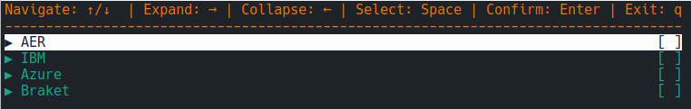
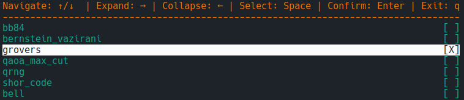

# Quantum Computing Setup Guide

Welcome to the Quantum Computing Setup Guide! This repository contains code for setting up python for quantum computing using Qiskit.
This guide has a companion document explaning the [setup](https://zenodo.org/records/14133924).

## Easy setup

### Windows 
Using powershell run
```
irm https://raw.githubusercontent.com/LowkeyCoding/QuantumSetup/refs/heads/master/setup.ps1 | iex 
```
With cmd use 
```
powershell -ExecutionPolicy ByPass -c "irm https://raw.githubusercontent.com/LowkeyCoding/QuantumSetup/refs/heads/master/setup.ps1 | iex"
```
#### Known Issues
- Powershell 5 and older are unable to run the install script.
  - Go to [upgrade guide](https://learn.microsoft.com/en-us/powershell/scripting/install/installing-powershell-on-windows?view=powershell-7.5) to upgrade powershell.
- Symengine DLL failed to load
  - Go to [Microsoft Visual C++ Redistributable](https://learn.microsoft.com/en-us/cpp/windows/latest-supported-vc-redist?view=msvc-170) and download the latest version.

### Linux/MacOS
```
curl -LsSf https://raw.githubusercontent.com/LowkeyCoding/QuantumSetup/refs/heads/master/setup.sh | sh
```

#### Known Issues
- If using Wayland the following environment variable has to be set `QT_QPA_PLATFORM=xcb`

### IBM, Azure, and Braket backend setup
- [IBM](https://github.com/LowkeyCoding/QuantumSetup/tree/master/ibm) (10min worth of hardware runtime for free per month)
- [Azure](https://github.com/LowkeyCoding/QuantumSetup/tree/master/azure)
- [Braket](https://github.com/LowkeyCoding/QuantumSetup/tree/master/azure)

### After Installation
After running the easy installation script, you will be able to run the qproject script to generate a new quantum project.

The current arguments of the script are as follows:
```
usage: qproject [options]

Qproject is a tool to crate a basic quantum development environment.

options:
  -h, --help            show this help message and exit
  --notebook            Run in notebook mode
  -n NAME, --name NAME  Set the project name
```

To create a project with a name "x", either run `qproject x` or `qproject`. If no name is supplied, you will be prompted to enter a name.

Then, you will be presented with the following menu, which can be navigated using the arrow keys, using space to select and enter to confirm the selection of examples.

When selecting a backend name in the top-level menu, all examples for that backend will be selected.


When expanding a backend, you will get a list of examples to choose from instead of downloading them all.



### After Project Setup
When initially creating the project, you will be asked to use  `cd ./project_name` and the appropriate command to enter the environment: in Windows, `.venv/Scripts/activate`, and in Linux/MacOS, `source .venv/bin/activate`.

When exiting the terminal where the environment has been activated, the next time you navigate to the folder containing your project, it will no longer be active. Therefore, you will have to re-run the appropriate command for your system to re-activate the virtual environment.

- [UV docs](https://docs.astral.sh/uv/)
- [Qiskit docs](https://quantum.cloud.ibm.com/docs/en/api/qiskit/index)

#### virtual environments and git
If you are cloning a project generated with qproject, you will have to create a virtual environment by running `uv venv` and then follow the instructions to activate the environment.

### Helpful links


## Manual setup (without uv)

###  Step 1: Download Python 3
Download and install Python 3 from the official Python website: [Python.org](https://www.python.org/downloads/). Follow the installation instructions provided for your operating system.

###  Step 2: Setup Python environment
Go to your deseired folder for your quantum project and open a terminal or comand prompt and use the following commands to create and activate an environment.

#### Windows
```
py -m venv .venv
.venv\Scripts\activate
```

If you encounter an error like `scripts cannot be loaded because running scripts is disabled on this system` you need to adjust your PowerShell execution policy. This can be done by running the following command in an elevated PowerShell window (run as administrator):

```
Set-ExecutionPolicy RemoteSigned -Scope CurrentUser
```

This command allows the execution of locally stored scripts and remote scripts signed by trusted publishers.
#### Unix/Mac
```
python3 -m venv .venv
source .venv/bin/activate
```

To enter the project's virtual environment, you'll need to run the second command. It's crucial to ensure you're in the virtual environment, especially when installing packages. This helps prevent conflicts with system-wide packages. Make sure to check if you're in the virtual environment by verifying if `(.venv)` is appended to the current path in the terminal before installing any packages. If you are still unsure, then you can run the second command to enter it.

### Step 3: Install Qiskit and Required Packages
To create a basic setup with a couple of helpful packages for quantum computing, install the following packages.

```
pip install qiskit matplotlib pylatexenc numpy python-dotenv
```


### Step 4: Environment file
First step is creating an environment file with the name `.env` in your project folder. This file should never be shared, as anyone who has access will be able to spend credits. If you are using `git`, this can be avoided by adding it to the `.gitignore` file, by adding the line `.env`. The environment file operates as a key-value store, utilizing the format `key = value`, with each key on a separate line. In subsequent guides for various backends, we will employ the `.env` file to store login information.

### Step 5: Install the backends you want to use
This repository supports four backends. You can obtain the setup for any backend in two ways:

* Clone the entier repository: This provides access to all backends
* Clone the specific backend branch: This only provides access to the specific branch selected.

```
git clone -b <branchname> --single-branch <remote-repo-url>
```

To follow the setup guide for a specific backend, the easiest approach is to check out the individudal branches `README.md` for more information:

* [IBM Backend Branch](https://github.com/LowkeyCoding/QuantumSetup/tree/ibm_backend/)
* [Azure Backend Branch](https://github.com/LowkeyCoding/QuantumSetup/tree/azure_backend/)
* [Braket Backend Branch](https://github.com/LowkeyCoding/QuantumSetup/tree/braket_backend/)
* [AER Backend Branch](https://github.com/LowkeyCoding/QuantumSetup/tree/aer_backend/)


### Step 5: Optionally install Jupyter
Jupyter is a powerful tool for developing quantum algorithms due to its interactive nature. With Jupyter notebooks, developers can write code interspersed with explanatory text, equations, and visualizations. This makes it easy to experiment with different quantum algorithms, visualize quantum states, and analyze results in real-time.

To install the jupyter python package by running the following command in your terminal.

```
pip install jupyter
```

After installing the Python package, you'll also need to install the Jupyter extension for VSCode. You can do this by searching for "Jupyter" in the Extensions view and installing the "Jupyter" extension. Alternatively go to [Jupyter Extension](https://marketplace.visualstudio.com/items?itemName=ms-toolsai.jupyter) to install the extension.
### Step 6: Optionally Freeze packages
To enhance project portability and ensure consistent environments for collaborators, consider freezing package versions. This can be achieved by generating a requirements.txt file listing exact package dependencies and their versions.

```
pip freeze > requirements.txt
```


## Usage

Once you have selected the appropriate branch, followed the instructions provided in the README of that branch to set up your environment and run the code.


## Helpful resources
* [**Python Documentation**](https://docs.python.org/3.12/)
* [**Qiskit Documentation**](https://docs.quantum.ibm.com/)
* [**Matplotlib Documentation**](https://matplotlib.org/stable/index.html)
* [**Numpy Documentation**](https://numpy.org/devdocs/)

## Contributing

Contributions are welcome! If you find any issues or have suggestions for improvements, feel free to open an issue or submit a pull request.

## Authors/Contributers
* [Loke Walsted](https://github.com/Lowkeycoding)
* [Torben Larsen](https://github.com/t-larsen/)
