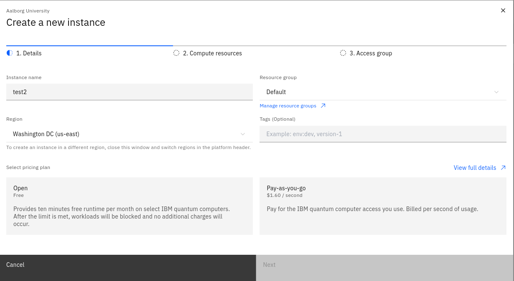
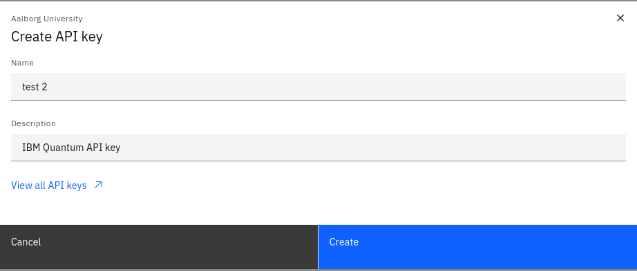

# Step 1: Setup the Backend

If you're using Windows, open Command Prompt (cmd.exe) or PowerShell. If you're using Unix-based systems like Linux or macOS, open Terminal.
Run the following command to install the azure backend and other required dependencies:

## Windows
```
.venv\Scripts\activate
pip install qiskit-ibm-runtime
```

## Unix

```
source .venv/bin/activate
pip install qiskit-ibm-runtime
```

Unix users may need to install `PyQt5` if they dont use Jupyter to show plots
```
pip install PyQt5
```

# Step 2: Get API key and CRN from IBM Quantum Dashboard

Go to the IBM Quantum Dashboard website (https://quantum.cloud.ibm.com).
If you don't have an account, sign up for one. Otherwise, log in.
Then go to (https://quantum.cloud.ibm.com/instances) and create a new instance.

Then fill out the form and press next twice

After creating the instance you should be redirected to (https://quantum.cloud.ibm.com/) with the new instance in sidebar.

Then the first step is to copy and save CRN to your `.env` file as `ibm_crn=Your CRN token here`

Then the second step is to click the create API key button.

Then give the api key a name and click create.


Then copy the API key to your `.env` file as `ibm_token=Your IBM token here`


```python
from qiskit import QuantumCircuit, transpile
from qiskit.visualization import plot_histogram
from qiskit_ibm_runtime import QiskitRuntimeService
from matplotlib import pyplot
from dotenv import load_dotenv
import os

load_dotenv()

provider = QiskitRuntimeService(token=os.environ["ibm_token"], channel="ibm_cloud", instance=os.environ["ibm_crn"])
```

With these two steps completed, you'll have Qiskit installed and configured to use IBM Quantum hardware. You can then start experimenting with quantum circuits and running them on real quantum computers provided by IBM.

# Step 3: Running a quantum circuit.
Running quantum circuits is a bit different on IBM. They've changed how programs are run and how backends are selected, as they only have their own hardware. Backends are selected by choosing the least busy. For manual backend selection, the method used for Azure or AWS can be applied. It's important to note that using their cloud quantum simulators is deprecated after 15/05/2024; any program run is on real hardware. When running the example quantum program below, be aware that IBM's cost estimates usually have a large margin of error (When I ran it, it said 649 seconds. It actually took 2...).
```python
from qiskit import QuantumCircuit, transpile
from qiskit.visualization import plot_histogram
from qiskit.transpiler.preset_passmanagers import generate_preset_pass_manager
from qiskit_ibm_runtime import QiskitRuntimeService, SamplerV2 as Sampler
from matplotlib import pyplot
from dotenv import load_dotenv
import os

load_dotenv()

provider = QiskitRuntimeService(token=os.environ["ibm_token"], channel="ibm_cloud", instance=os.environ["ibm_crn"])

# Selecting a backend
# Use simulators to test before running it on real hardware.
# Simulators will be depricated on 15/05/2024 see Aer for local simulation
backend = provider.least_busy(operational=True, simulator=False, min_num_qubits=127)

circ = QuantumCircuit(3, 3)
circ.name = "My First Quantum Program"
circ.h(0)
circ.cx(0, 1)
circ.cx(1, 2)
circ.measure_all()

circ.draw('mpl')

# Transpile circuit to work with the current backend.
pm = generate_preset_pass_manager(backend=backend, optimization_level=1)
isa_circuit = pm.run(circ)
# Run the job
sampler = Sampler(backend)
job = sampler.run([isa_circuit], shots=100)

# Get the result
result = job.result()
counts = result[0].data.meas.get_counts()
# Plot the result
plot_histogram(counts)
pyplot.show()
```
The example can also be seen [here](https://github.com/LowkeyCoding/QuantumSetup/blob/ibm_backend/sample.py)

# Step 5: Running simulator after the 15th of may 2025
To access advanced simulation capabilities in Qiskit of IBM systems, the `qiskit-aer` package is required.

```
pip install qiskit_aer
```

To run a simulation, it is required to first load the real hardware backend from IBM as in the previous step and then use the backend to instantiate the Aer simulator.

```python
from qiskit_aer import AerSimulator
from qiskit import QuantumCircuit, transpile
from qiskit.visualization import plot_histogram
from qiskit_ibm_runtime import QiskitRuntimeService
from matplotlib import pyplot
from dotenv import load_dotenv
import os

load_dotenv()

provider = QiskitRuntimeService(token=os.environ["ibm_token"], channel="ibm_cloud", instance=os.environ["ibm_crn"])

# Selecting a backend hardware from ibm.,
real_backend = provider.least_busy(operational=True, simulator=False)
# Instantiate Aer simulator with hardware backend.
backend = AerSimulator.from_backend(real_backend)
```

The full example can be seen [here](https://github.com/LowkeyCoding/QuantumSetup/blob/ibm_backend/examples/qrng.py)
